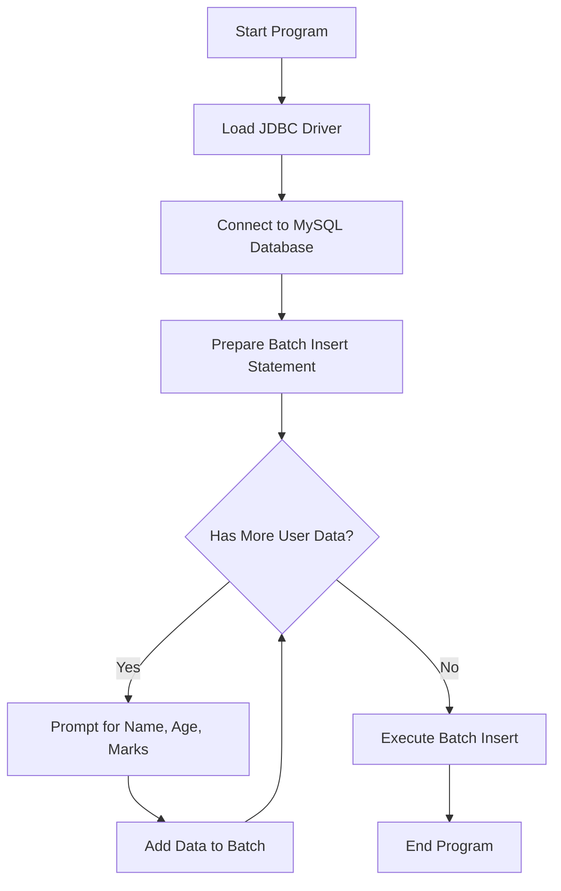

# Main.java Documentation

This document provides an in-depth explanation of the `Main.java` file. It outlines the structure, function, and flow of the code which is designed for batch insertion of student records into a MySQL database using JDBC in Java. The code also demonstrates best practices in database access, such as using prepared statements to prevent SQL injection.

---

## Purpose and Overview

The main objective of this program is to allow users to **add multiple student records** to a database efficiently by utilizing batch processing and prepared statements. It connects to a MySQL database, prompts the user to input student data, and inserts these into the `students` table. The code provides a safe and scalable way to perform database operations.

---

## High-Level Flow

The program follows these steps:

- Loads the JDBC driver
- Connects to the MySQL database
- Prepares an SQL statement for batch insertion
- Prompts the user for student details in a loop
- Executes the batch insert operation

---

## Key Components

### Database Connection

The following credentials and URL are used for connecting to the local MySQL database:

```java
private static final String url = "jdbc:mysql://localhost:3306/mydbs";
private static final String username = "root";
private static final String password = "Aditya@2709090";
```

- **url:** Points to a database named `mydbs` on localhost, running on the default port 3306.
- **username & password:** Credentials for database access.

---

### Initialization and Driver Loading

Before any database operation, the code ensures the MySQL JDBC driver is available:

```java
try {
    Class.forName("com.mysql.cj.jdbc.Driver");
} catch (ClassNotFoundException e) {
    System.out.println(e.getMessage());
}
```

This is critical for older JDBC usage, ensuring database connectivity.

---

### Batch Insert with Prepared Statement

The core logic prompts for student data and builds a batch insert:

```java
String query = "INSERT INTO students(name,age,marks) VALUES(?, ?, ?)";
PreparedStatement preparedStatement = connection.prepareStatement(query);

while (true) {
    // Prompt user input for name, age, marks
    // Set parameters and add to batch
    // Break loop if user does not want to add more
}
int[] arr = preparedStatement.executeBatch();
```

- **PreparedStatement**: Prevents SQL injection and increases efficiency.
- **Batching**: Reduces round-trips to the database server.

---

## User Interaction Flow

### Input Loop

The code interactively collects data:

- **Name:** String input
- **Age:** Integer input
- **Marks:** Double input
- **Continue?:** User can add multiple students in one run; entering 'N' or 'n' exits the loop.

### Example Console Input

```
Enter Name: Alice
Enter Age: 20
Enter Marks: 95.2
Enter More Data(Y/N): Y
Enter Name: Bob
Enter Age: 22
Enter Marks: 88.0
Enter More Data(Y/N): N
```

---

## Error Handling

- **Driver load failure:** Outputs the exception message.
- **SQL exceptions:** Caught and printed, but not rethrown or logged.

---

## Important Methods and Classes

| Element              | Purpose                                                                |
|----------------------|------------------------------------------------------------------------|
| `Class.forName()`    | Dynamically loads the JDBC driver                                      |
| `DriverManager.getConnection()` | Establishes a connection to the database              |
| `PreparedStatement`  | Prepares precompiled SQL for safe, efficient execution                 |
| `Scanner`            | Handles user input from the console                                    |
| `executeBatch()`     | Executes all batched statements as a single transaction                |

---

## Security and Best Practices

- **PreparedStatement:** Prevents SQL injection.
- **Batch Processing:** Improves performance for multiple inserts.
- **User Prompts:** User-driven, but no input validation is performed.

---

## Database Interaction Flow

Below is a diagram that captures the main steps from application launch through user input to batch database insertion.



---

## Example: Batch Insert Logic

Here is a focused code extract that shows the batch insert logic:

```java
while(true){
    System.out.print("Enter Name: ");
    String name = scanner.next();
    System.out.print("Enter Age: ");
    int age = scanner.nextInt();
    System.out.print("Enter Marks: ");
    double marks = scanner.nextDouble();
    System.out.print("Enter More Data(Y/N): ");
    String choice = scanner.next();
    preparedStatement.setString(1, name);
    preparedStatement.setInt(2, age);
    preparedStatement.setDouble(3, marks);
    preparedStatement.addBatch();
    if (choice.toUpperCase().equals("N")){
        break;
    }
}
preparedStatement.executeBatch();
```

---

## Table: Main Class Structure

| Section                         | Description                                |
|----------------------------------|--------------------------------------------|
| `main` method                   | Entry point; orchestrates all operations   |
| JDBC Driver loading             | Ensures database connectivity              |
| Database connection             | Opens connection to MySQL                  |
| Prepared statement setup        | Enables safe, parameterized queries        |
| User input collection           | Reads and batches student data             |
| Batch execution                 | Inserts all input rows at once             |
| Exception handling              | Catches and prints errors                  |

---

## Possible Enhancements

- **Add input validation** for age and marks.
- **Provide feedback** after inserts (e.g., rows inserted).
- **Log exceptions** for debugging.
- **Close resources** (`Scanner`, `PreparedStatement`, and `Connection`) in a finally block.
- **Support for other CRUD operations** (commented code already hints at this).

---

## Security Note

```card
{
    "title": "Database Password Exposure",
    "content": "Avoid hardcoding credentials in code. Use environment variables or configuration files for real-world applications."
}
```

---

## Summary

- This code is a foundation for a console-based data entry tool for student records.
- It focuses on safe database interaction and efficient batch processing.
- It is suitable for learning JDBC, batch statements, and basic Java console I/O.

---

## License

This documentation is generated for educational purposes and illustrates best practices in Java database access. Please do not use hardcoded credentials in production environments.
